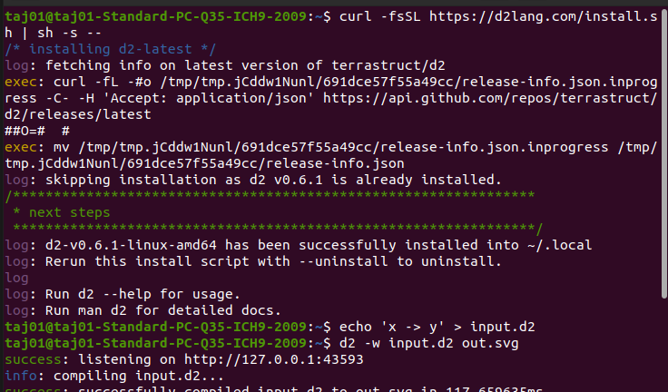
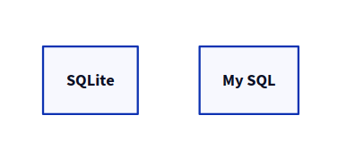

# <Center> D2 (Declarative Diagram) </Center>

Table of contents:
1. [Overview](#Overview)
2. [Installation](#Installation)
3. [Shapes](#shapes)
4. [Connections](#connections)
5. [Containers](#containers)
6. [Special objects](#special-objects)

  - Text & Code
  
  - Icon & Images

  - SQL Tables

  - UML Classes
  - 

 


## <Center> Overview  </Center>

D2 is a diagram scripting language that turns text to diagram. It stands for declarative diagramming. Declarative means it describe what we want to diagrammed it generates the image.

### **<Center>Features of D2 </centre>**

1. Easy to use.
2. Supports wide variety of formats like PPT and GIF.
3. Provide better readability.

For example, here's two ways to define a cylinder.

**D2:**

```
A: Christmas {shape: cylinder}
```
**Mermaid**

```
A[(Christmas)]
```
D2's is a little less compact but a lot more readable.

## <center> Installation </center>

For linux I have used the below command:

```
curl -fsSL https://d2lang.com/install.sh | sh -s --
```
- This command is a tool for transferring data with URLs. 

- In this context **curl** being used to download the contents of a file from the specified URL.

- **-fssl** used to download scripts without showing progress information and to handle various scenarios, such as server errors or redirects.

- https://d2lang.com/install.sh: This is the URL from which the script (install.sh) will be downloaded.

- **sh -s** executes the downloaded script using the Bourne shell (sh).

- This ' -- ' used to signify the end the command line options.




After successfully installing D2, I installed the **VS Code editor** by using the command:

```
sudo snap install --classic code
```
- After installing VS Code, I installed the D2 extension, and then create a file using the extension '.d2', for example, 'Diagram.d2'.

- I can also practice diagrams on the official website of D2lang.com, where there is an option available in the top right corner called Playground.


<Center></Center>


Here are some practice diagrams created using the D2 tool in VS Code, which are given below.

## <center> Shapes </center>

D2 provide a list of shapes that we can easily use for diagram creation.

We can declare shapes like so:

```
imAShape
im_a_shape
im a shape
i'm a shape
```
- All of these can be used for defining the shape of any object. However, different formats cannot change the size of the shape.

```
# notice that one-hyphen is not a connection
# whereas, `a--shape` would be a connection
a-shape
```
a-shape


a -- mango


- This shows the connection between two shapes.


- I can also use semicolons to define multiple shapes on the same line:

```
SQLite; MySQL
```




By default, a shape's label is the same as the shape's key. But if we want it to be different, we can assign a new label like so:

```
pg: PostgreSQL
```
By default, a shape's type is rectangle. To specify otherwise, provide the field shape:

```
Cloud: my cloud
Cloud.shape: cloud
```
Example 1:

```
cloude:my cloude
cloude.shape:shape
```


Example 2:

```
person:user

person.shape:person
```


### <Center>Connections </center>

~~~
x->y:hello world
~~~
This declares a connection between two shapes , x and y, with the label hello world. 


- There are 4 valid way to define a connections:

~~~
<-> 
->
<-
- -
~~~
Example 2.1:
~~~
Write replica Canada<-> Write replica Australia
~~~


This declares the bi-directional relationship between two shapes, replica Canada and Replica Australia.

Example 2.2:
~~~
Read Replica <- Master
~~~


Example 2.3:
~~~
Lucknow - - Prayagraj
~~~


This declares the relationship between two shapes without any direction.

Example 2.4:

~~~
super long shape id here --\
 -> super long shape id even longer here
~~~


-\  (Here, I am using this symbol to break the syntax line size without impacting the image).


**- Repeated Connections:**

Repeated connections do not override existing connections. They declare new ones:
~~~
Database -> S3: backup
Database -> S3
Database -> S3: backup
~~~


- **Cycles:**
~~~
Step One -> Step Two -> Step Three -> Step Four
Step Four -> Step One: repeat
~~~


**This declares the repetition of the process.**

- **Arrowheads:**

To override the default arrowhead shape or give a label next to arrowheads, define a special shape on connections named .


~~~
a: United we stand,divided we fall
b: To thine own self,be true
c: Learn as if you will live forever, live like you will die tomorrow.
a -> b: To err is human, to moo bovine {
 source-arrowhead: 1
 target-arrowhead: * {
   shape: diamond
 }
}


b <-> c: If you can't handle stress you can't handle success  {
 source-arrowhead.label: 1
 target-arrowhead: * {
   shape: diamond
   style.filled: true
 }
}


d: Where there's a will there's a way


d -> a -> c
~~~


- **Reference connections:**
Reference a connection by specifying the original ID followed by its index.

~~~
x -> y: hi
x -> y: hello

(x -> y)[0].style.stroke: green
(x -> y)[1].style.stroke: yellow

 ~~~  

 


## Containers:
~~~
server
# Declares a shape inside of another shape
server.process
~~~


~~~
# Can declare the container and child in same line
im a parent.im a child


im a parent.im a child

# Since connections can also declare keys, this works too
apartment.Bedroom.Bathroom -> office.Spare Room.Bathroom: Portal
~~~


### Special Objects

Standalone text is Markdown.

~~~
Example:
explanation: |md
 # I can do headers
 - lists
 - lists

etc......
~~~


            

- **Latex:**

Latex or tex to specify a Latex language block.
~~~
plankton -> formula: will steal
formula: {
 equation: |latex
   \\lim_{h \\rightarrow 0 } \\frac{f(x+h)-f(x)}{h}
 |
}
~~~


- Icon or Images

Here we can use any url as value.

~~~
Github: {
    icon: https://icons.terrastruct.com/dev/github.svg
  
}
~~~


- **SQL Tables:**

Here, I can easily diagram entity-relationship diagrams (ERDs) in D2 by using the sql_table shape. Here's a minimal example:

~~~
my_table: {
  shape: sql_table
  # This is defined using the shorthand syntax for labels discussed in the containers section.
  # But here it's for the type of a constraint.
  # The id field becomes a map that looks like {type: int; constraint: primary_key}
  id: int {constraint: primary_key}
  last_updated: timestamp with time zone
}
~~~


- **UML Classes:**
  D2 fully supoorts UML class diagrams,Here's a example:

~~~
MyClass: {
  shape: class

  field: "[]string"
  method(a uint64): (x, y int)
}
~~~


- Each key of a class shape defines either a field or a method.

- The value of a field key is its type.

- Any key that contains ( is a method, whose value is the return type.

- A method key without a value has a return type of void.


- **Sequence Diagrams:**

  Sequence diagrams are created by setting shape: sequence_diagram on an object.
~~~
shape: sequence_diagram
alice -> bob: What does it mean\nto be well-adjusted?
bob -> alice: The ability to play bridge or\ngolf as if they were games.
~~~


**Rules**-
There is no special syntax to learn for sequence diagrams. The rules are also almost exactly the same as everywhere else in D2, with two notable differences.

**Scooping**

Children of sequence diagrams share the same scope throughout the sequence diagram.

~~~
Office chatter: {
  shape: sequence_diagram
  alice: Alice
  bob: Bobby
  awkward small talk: {
    alice -> bob: uhm, hi
    bob -> alice: oh, hello
    icebreaker attempt: {
      alice -> bob: what did you have for lunch?
    }
    unfortunate outcome: {
      bob -> alice: that's personal
    }
  }
}
~~~


Outside of a sequence diagram, there would be multiple instances of alice and bob, since they have different container scopes. But when nested under shape: sequence_diagram, they refer to the same alice and bob.
              
