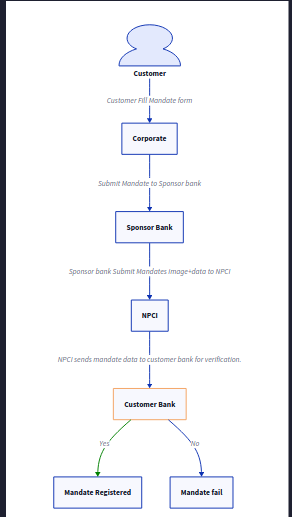

# NACH Process 

**NACH:**

In 2016 ,National Payments Corporation of India launched the National Automated Clearing house(NACH) service as a centralised system to enable automated clearing of inter-bank ,high volume electronic transactions.

**Process:**

- Companies provide NACH mandate forms to customers to get their consent for debiting their account at a certain frequency for a certain period of time.

- The Company will verify all details provided by customers in their NACH mandate form.

- Upon successful verification, the company/corporate will forward the form to its sponsor bank.

- The bank will send the mandate form to NPCI.

- Once the details are fully validated, NPCI will forward the mandate form to the customer’s bank.

- Upon approval of the customer’s bank, the company is permitted to debit funds from the customer’s account. 

- If the customer’s bank mandate registration fails due to any false information, the customer’s bank redirects the information to NPCI, which then  redirects this information to sponsored bank. The sponsored bank subsequently redirects this information to the corporate.

Diagram:

