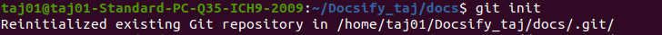

 <h1 align="center"> Docsify Setup</h1>

 ### Docsify- 
 * Docsify is a documentation site generator that focuses on simplicity and ease of use.

 * With Docsify, we can quickly turn our documentation content into a user-friendly website with navigation, search functionality, and other useful features.

 >> ### Setup of Docsify

## Step 1

 Here we are asking Podman to display information about all containers, including those that are not currently running, in the current environment.

> **podman ps -a**

>> ps - **The ps command stands for "process status." In the context of podman, it is used to list containers and their current status.**

>> -a- **The -a flag is a command-line option that stands for "all." When used with the ps command, it instructs podman to show all containers, including those that are stopped or exited, in addition to the running containers** 

## Step 2

Make directory with the name of **myapp** and then instruct the system to change the current diarectory to the **myapp**diarectory 
>  **mkdir myapp**

>  **cd myapp**

>> mkdir: **mkdir is a command-line utility that stands for "make directory." It is used to create a new directory (also known as a folder) within a file system.**

>> myapp - **Is the name of directory that I have created**

>> cd: **cd is a command-line command that stands for "change directory." It is used to navigate between different directories (folders) in a file system.**

## Step 3

Instruct vim editor to open file named **Docker file** for editing.

> Here **vi** is the Vim text editor and here i am instructing it to open a file name **Dockerfile** for editing. 
**Dockerfile is the name of the file that I want to open.

## Step 4
Now create an empty file with the name of **index.html** also make md file with the name of **README.md**
 > **touch index.html**

> #### Now enter the index.html file and paste the HTML syntax.

## Step 5

>Now enter the README.md file using the vim command so that the Document text can be updated automatically.

> **vim README.md**

## Step 6

Now move the file **dockerfile** from the myapp directory to the current directory 
>**mv myapp/dockerfile .**

> Also instruct the Podman to built docker image using the dockefile named Dockerfile and tag the resulting image as **docsify/demo**.
Syntex : **podman build -f dockerfile -t docsify/demo** 

* **-f(--file)** -This option is used to specify the path to the Docker file that should be used for building the image.
* **-t(--Tag)** - This option used to specify a name and optional tag for the image being build. 

>>This output provides a detailed view of the steps taken to build the docker image and indicates the use of cached layers to optimizing the build process. The resulting image is tagged as **localhost/docsify/demo:latest**

## Step 7
>Now list the container images that are currently available in your system using the container management tool.

> **podman ps**

## Step 8 
**Run the docker image** 

>**podman run -itp 3000:3000 --name=docsify -v $(pwd):/docs docsify/demo**

* The command started a container, named it "docsify", mapped port 3000 from the host to the container, mounted the current working directory from the host into the container's "/docs" directory, and launched a Docsify server that is accessible at "http://localhost:3000". 
* The provided output confirms that the container is successfully serving content and listening on the specified port.

## Step 9

>Run local host on browser.

# GitHub
GitHub is a widely used platform for hosting and managing software projects using the Git version control system. It provides a collaborative environment for developers to work together on projects, track changes, and manage code repositories.

>> ### Setup of GitHub

## Step 1

> Create a new repository.

> Click on **New repository**

## Step 2

>Now enter your repository name and make it **public**

# Docsify and Git intigration 

##  Step 1

#### For creating a new repository on CLI follow all these steps 
* git init
* git add README.md 
* git commit -m "first commit" 

## Step 4

>**When we change  and update something in our document , run following commands:**
* git branch -M main
* git remote add origin http://github.com.taj4990/docsify_taj.git
* git push -u origin main
* Enter the user name and then enter.
* Now for password goto Git settings and create token and make some changes.

* Click on developer setting
in the left hand side bottom .

* Select Personal access token.

* Select classic token.

* Generate classic token.

* Varify login

* Give name of your token and marks all the boxes and click on create.

* **after that copy the token and paste that on your CLI(Command line interface).**

>>**git branch -M main**

* **git: This is the command-line interface for the Git version control system.**

* **branch: This is a subcommand in Git used to manage branches within a repository.**

* **-M: This is a command-line option that stands for "move" or "move/rename."** 

* **main: This is the new name I am  assigning to the current branch.**

>>git push -u origin main

* **push: This is a Git command used to send my local changes to a remote repository.**

* **-u: This is a command-line option that stands for "set upstream." When used with the git push command, it establishes a tracking relationship between my local branch and the remote branch I am  pushing to.**